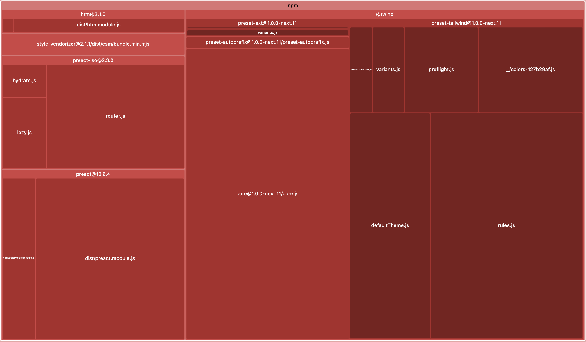
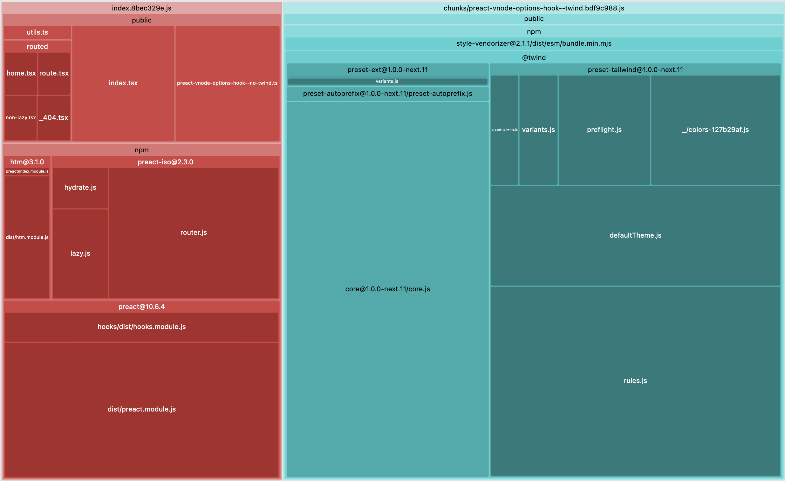
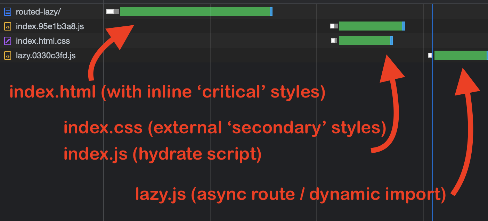
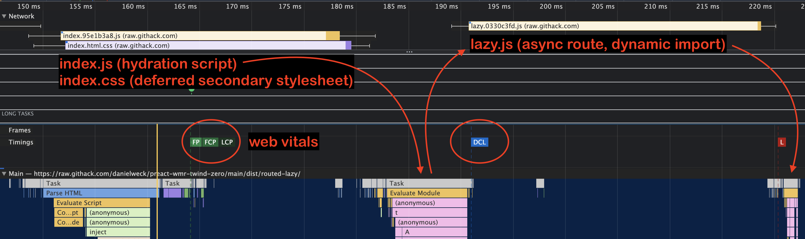

# Zero-runtime Twind integration in Preact WMR

(copyrights)

Hopefully my fun logo juxtaposition doesn't breach any copyright rules! If it does, please let me know and I will remove the PNG image from my repository :) Thanks!
The original SVG assets are:
<ul>
<li>Preact WMR &rarr; <a href="https://wmr.dev/assets/wmr.svg">https://wmr.dev/assets/wmr.svg</a></li>
<li>Twind &rarr; <a href="https://twind.dev/assets/twind-logo-animated.svg">https://twind.dev/assets/twind-logo-animated.svg</a></li>
</ul>

## Summary

This project demonstrates a recipe for integrating Twind in a website built with Preact WMR. The code in this repository brings a few key ingredients to customise the standard WMR build process and Preact runtime:

* WMR plugin (Rollup under the hood).
* Preact VDOM "hook" (`options.vnode`).
* Post-build script that tweaks the default generated website.

Massive credits to the developers of:

* **Preact WMR** https://github.com/preactjs/wmr/
* **Twind** https://github.com/tw-in-js/twind/

## Project definition / scope

* This project emerged from a "curiosity itch" I wanted to scratch. That's it. I have no concrete plans regarding the evolution of this repository. This is made in my spare time, for fun.
* Caveat emptor - don't blame me if your cat explodes when you run my code! :exploding_head: :scream_cat:
* I welcome Pull Requests and feedback / suggestions via the issue tracker. If you find the information contained herein useful, let me know. Also let me know if I get things wrong. Thanks for sharing!
* This project is NOT yet another frontend or backend framework. I have neither the skills nor the inclination for this kind of endeavour ;)
* This project is not a general-purpose SSR/SSG+hydration solution, but aims to solve a very specific (niche?) problem, based on existing tooling.
* This project extends the "JAM Stack" functionality of Preact WMR, namely the ability to pre-render an entire website so it can be uploaded to a static host. This is known as static "SSR" Server Side Rendering, or "SSG" Static Site Generation. That being said, Preact WMR is a smart framework that implements a hybrid  model of "MPA" Multi Page Application + "SPA" Single Page Application. Check out their website for more information.
* This project is somewhat opinionated in the sense that the customised build process forces a particular way of invoking Twind APIs. For example, Twind's `tw` and `shortcut` function calls must be "proxied" via this project's own tagged template literals `` twindTw`_` `` and `` twindShortcut`_` ``. On the plus side, these are configured to enable Visual Studio Code "Intellisense", courtesy of Twind's own plugin (i.e. autocompletion, error highlighting and rich information popup).
* This project currently doesn't support all of Twind's functionality, notably the more advanced CSS-in-JS features. As Twind v1 is now just coming to fruition (at the time of writing, January 2022), I plan to research the feasibility of integrating additional useful APIs.

The contents of this repository are published under the BSD3 open source license ( https://opensource.org/licenses/BSD-3-Clause ).

FYI: my original stream of consciousness in a Twind discussion thread: https://github.com/tw-in-js/twind/discussions/147

## Quick Start

### Prerequisites

* NodeJS 16+ ( https://nodejs.org )
* `pnpm install` ( https://pnpm.io or can be installed via NodeJS CorePack)

Alternative package managers:

(note that this will probably work fine, but this is not recommended as this project's frozen dependencies are defined by `pnpm-lock.yaml`, I do not maintain a `package-lock.json` or `yarn.lock` in parallel)

* `npm install` ( ships with https://nodejs.org )
* `yarn` ( https://yarnpkg.com or can be installed via NodeJS CorePack)

### Development server (vanilla Preact WMR):

* `pnpm run start` (CTRL+C to kill the source "watcher" process and HTTP server)
* Open your web browser at URL `http://127.0.0.1:8080`

### SSG pre-rendering / whole-site static SSR (vanilla Preact WMR):

* `pnpm run build` (if you experience a "segmentation fault" in your console, or if the build ends prematurely without `dist` files, try again ... this is a known Preact WMR bug with Node 16)
* `pnpm run build-viz` (this adds Preact WMR's option `--visualize` and the generated bundle dependency treemap will automatically be opened in your default web browser)
* `pnpm run serve` (CTRL+C to kill the HTTP server)
* Open your web browser at URL `http://127.0.0.1:8080`

## Zero-runtime Twind?

Twind emulates the Tailwind feature-set (utility classes, etc.) but it is primarily designed for JIT "just in time" CSS stylesheet production based on actual, dynamic class usage in a rendered web document. In other words, Twind does not impose complicated and costly compile steps, such as configuring and executing style "purging". Twind also offers several powerful CSS-in-JS features which help create a logical, composable and scalable organisation of component styles. By this (simplistic) definition, Twind's runtime is therefore pretty much expected to be shipped on the client side, and to execute in the web browser in order to render the web page's styles.

That's absolutely fine in most cases, as Twind consists in a relatively lightweight code bundle (given its expansive feature set), and the runtime computations are fast too (hashing, caching, comparing/ordering, etc.).

It does makes total sense to leverage Twind's intrinsic "JIT" qualities during development (especially with Preact WMR's dev server), but I wanted to explore techniques that would allow me to reliably eliminate Twind in production builds ("reliably" === without leaving behind some unprocesed styles, e.g. dynamic component styles).

### Twind runtime shipped in client-side Javascript bundle (red)

### Twind runtime only used on the server (blue)

These "tree map" graphics were generated using Preact WMR's `--visualize` option, they show the relative sizes of dependencies (including `gzip` compression) inside the Javascript bundles generated by Rollup / Terser (i.e after tree shaking and minification).

I am providing these graphics purely to illustrate how the removal of Twind's runtime from the client-side JS code bundle can *potentially* yield desirable performance benefits. But let's be real: these graphics are misleading, as they exaggerate the impression due to the scale of my minimalistic demo app! In a real-world full-size website, Twind's footprint would be dwarfed under the weight of neighbouring dependencies.

In order to maximise website performance and to hit desirable "web vitals" metrics, there are several other key avenues to consider. This project implements techniques to generate "critical" vs. "secondary" CSS stylesheets, derived from Twind's compiled utility classes (i.e. ordered CSS selectors / rules to form a styling cascade). More on this further down in this document.

### Code splitting

Preact WMR supports native asynchronous module imports, which means we can dynamically load Javascript bundles by awaiting a Promise (i.e. network fetch + code loading). At development time, the ECMAScript modules are loaded as-is, but the build process powered by Rollup resolves dependencies and aggregates modules into production-ready, self-contained code bundles.

Here this common technique is leveraged in order to isolate Twind and its dependencies. Some client-side logic ensures that the Twind code bundle is only used on the server to pre-render documents, never loaded in the web browser. Preact WMR uses "isomorphic" code that works in both web browser and Node runtimes, so that static SSR / SSG + client-side hydration works seamlessly. In fact, Preact WMR provides its own "iso" router solution which supports asynchronous routes, based on a technique similar to React's "suspense" (thrown Promises).

### Critical vs. secondary CSS stylesheets

The basic premise of Preact WMR's pre-rendering method is that each statically-generated HTML page is a distinct "entry point" into a complete website, with route paths reflected in the folder hierarchy created on the filesystem (remember: static hosting first and foremost!). Once a content route gets hydrated on the client / by the web browser, the page becomes a SPA inside which other routes are resolved without actual network requests to their server URL endpoints (until the next "hard" page reload, of course).

As previously mentioned, Preact WMR's isomorphic router supports "lazy" / dynamic component imports, which enables code splitting and consequently minimises the footprint of the initial web app "shell". Preact WMR's server-side pre-rendering build process is capable of awaiting lazy routes in order to generate their static rendition, whilst the client-side hydrated SPA implements deferred code bundle fetch and execution.

An important performance optimisation technique is to differentiate "critical" CSS styles versus "secondary" ones. In this project, the stylesheet deemed "critical" is inlined in the document head, and therefore contributes to the initial HTML document network payload. The so-called "secondary" stylesheet is a separate file that the web browser fetches with a lower priority during the initial loading phase, and as such, this external network resource benefits from HTTP caching.

It is commonly accepted that the notion of "critical" styles applies to content that is "above the fold" in a web page, but in this project they are CSS rules required to render the current / initial static route (i.e. the entire active DOM, including fragments out-of-view in the scrolling viewport). The "secondary" stylesheet is populated with all the other styles (i.e. the "remainder") that the SPA might need when the user navigates to another client-side route (at which point the DOM typically mutates as a result of dynamic component mount/unmount lifecycle).

The "critical" stylesheet is granted a high priority during the early browser loading stages, simply by virtue of being embedded directly in the document head. The "secondary" stylesheet (pre)loads in the background / asynchronously, to avoid blocking the main render thread. This is orchestrated by simple markup in each `index.html` route pages, and a tiny line of Javascript that signals the activation of the stylesheet so that the browser can start consuming it.

Here is a super-reduced network waterfall and performance flamechart report that illustrate the principle (note the parallelised fetch of Javascript code bundles and secondary CSS stylesheet, relative to the timing of web vitals):

Side note: multiple "secondary" stylesheets (i.e. individual payloads bound to dynamic components or routes) are currently not supported. With static SSR / SSG, we work on the assumption that the static entry point / HTML page has its own "critical" styling, and that from the point in time at which the SPA is hydrated, we cannot predict which route / dynamic component will be loaded next. That is why we bundle the remainder CSS rules in the "secondary" stylesheet. Although the aggregation logic ensures that there are no duplicated definition of utility classes, the coverage of the "secondary" stylesheet is the rest of the website, so it can potentially grow large. We could of course segregate styling rules for each route / dynamic component, but this would likely introduce duplication (one of the "selling points" of utility classes is that they are very likely shared amongst components).

There is one obvious caveat when using this zero-runtime Twind integration recipe: it works with dynamic class names / parameterized tokens *only* if they can predictably be enumerated during server-side pre-rendering. For example, if a button has "pressed" and "keyboard focused" states (aka. style variants), and these can be expressed declaratively, then an enumeration of all possible states must be used to precompute the corresponding Twind classes, and to statically generate the required styles into the target stylesheet.

## Demonstration / test bed

This repository contains a minimal demo which makes it easy to manually inspect the generated HTML / CSS / JS:

* **View demo pages:** https://danielweck.github.io/preact-wmr-twind-zero/
* **Browse compiled demo files:** https://github.com/danielweck/preact-wmr-twind-zero/tree/gh-pages/
* **Explore demo source code:** https://github.com/danielweck/preact-wmr-twind-zero/tree/main/public

## DOCUMENTATION TODO

1) Explain how the custom Preact 'options' VNode interceptor is used to invoke Twind's `tw()` and `shortcut()` functions in "dev" mode and during Preact WMR's prerender build step, after the Twind WMR plugin has transformed tagged template literals to resolved Twind objects (that is the key technique which makes all the difference with other "static extraction" methods) Code references: https://github.com/danielweck/preact-wmr-twind-zero/blob/main/wmr-plugin-twind.mjs and https://github.com/danielweck/preact-wmr-twind-zero/blob/main/public/preact-vnode-options-hook--twind.ts and https://github.com/danielweck/preact-wmr-twind-zero/blob/main/public/preact-vnode-options-hook.ts
2) Demonstrate Suspense / lazy components, other that Preact WMR's lazy routes (i.e.dynamic imports too, but for components in the render tree within already-loaded routes).
3) Document edge cases with nested / recursive (tagged) template literals.
4) Provide an example of predictable enumeration of possible dynamic Twind classes / declarative variants, and include a technical solution in the demo (Preact Context just like in my old pre-V1 code?).
